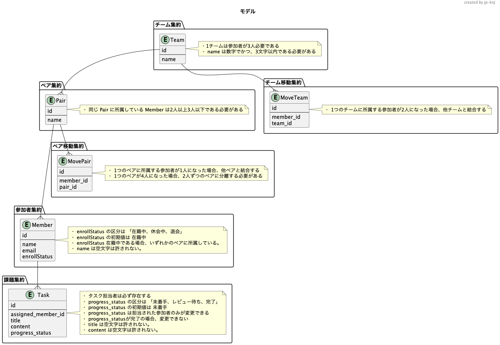

# praha challenge

## 使用技術

- フロントエンド

  - Next.js

- バックエンド

  - Nest.JS
  - Prisma
  - Postgres

- その他
  - Docker
  - husky/lint-staged
  - prettier/eslint
  - npm workspace

## 使用

```shell
# husky の準備
$ npm run prepare

# フロントエンドとバックエンドのコードスタイルを確認する
$ npm run format
```

## アーキテクチャ


## ユースケース


## オブジェクト


## モデル


